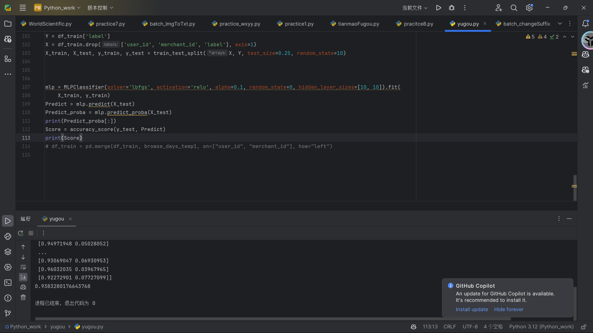
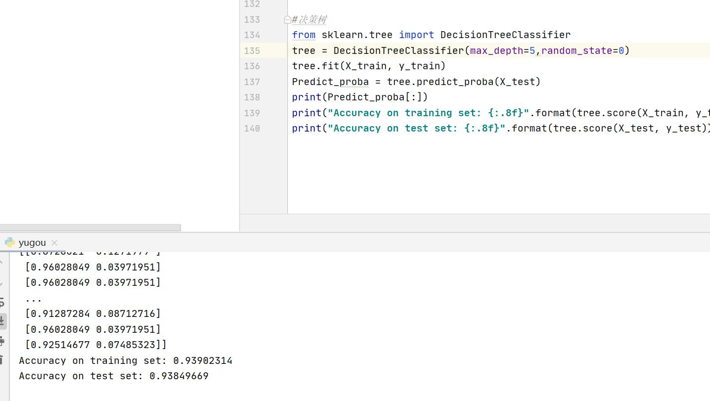
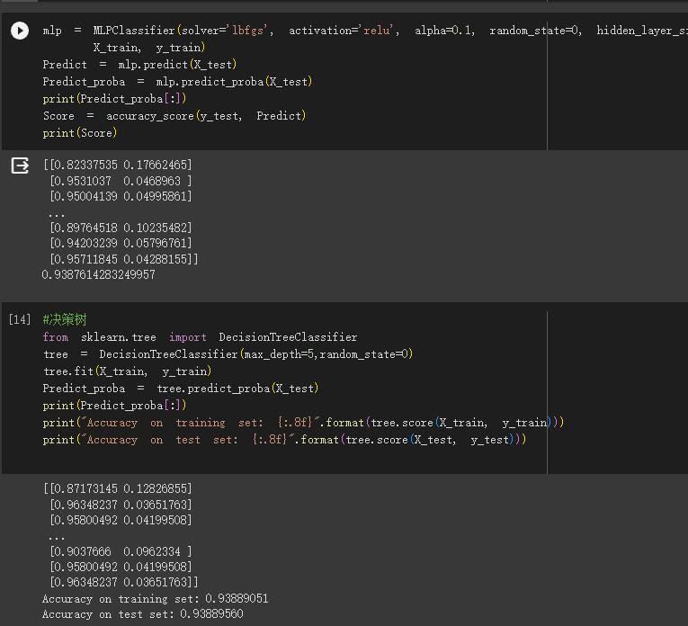

1.0:（朱家顺）提交初始版本，提供了完备的特征工程建立，和MLPClassifier分类器，效果图：
1.1:（张家豪）提交第二个版本，效果图：
1.2:（毛南）提交第三个版本，

对user_log中brand缺失数据进行填充处理

调整训练集和数据集的划分，使80%用于训练

年龄范围和性别缺失值使用均值填充

在决策树上使用adaboost分类器

使用网格搜索提供最优参数

效果图：

1.3：(苏沛泽)提交第四个版本，

考虑将多个模型融合，利用Stacking堆叠法，将两层算法进行串联。

在第一层中首先将多层感知机模型、逻辑斯特模型、决策树模型、随机森林模型、梯度提升回归树模型作为基础模型进行训练。

训练完后进行预测，得到预测结果后，将其预测结果转成二维矩阵作为一组新的特征交由第二层元学习器进行训练。

元学习器这里采用毛南设计好的adaboost分类器，通过将第一层基础模型的预测结果作为新的特征矩阵进行训练。

融合模型最终输出的预测结果就是元学习器输出的结果。
