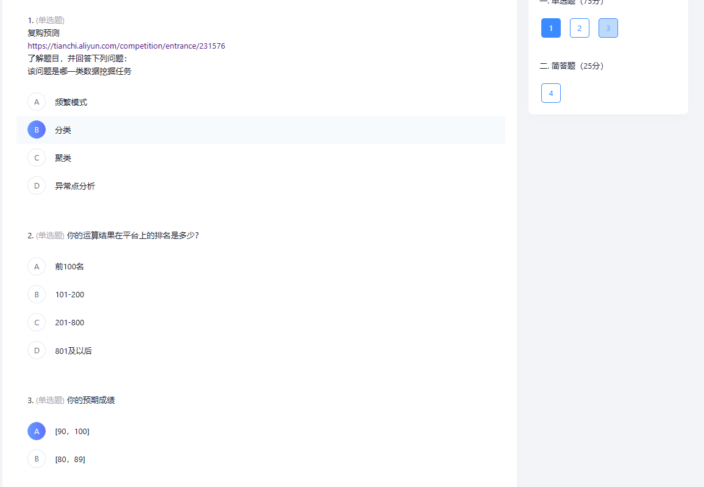

# 天猫复购预测

## 数据处理

数据集示例（sample_submission）：

| user_id | merchant_id | prob |
| ------- | ----------- | ---- |
|         |             |      |

用户行为日志（user_log_format1）：

| user_id            | item_id        | cat_id                 | seller_id        | brand_id           | time_stamp             | action_type                                                  |
| ------------------ | -------------- | ---------------------- | ---------------- | ------------------ | ---------------------- | ------------------------------------------------------------ |
| 购物者的唯一ID编码 | 商品的唯一编码 | 商品所属品类的唯一编码 | 商家的唯一ID编码 | 商品品牌的唯一编码 | 购买时间（格式：mmdd） | 包含{0, 1, 2, 3}，0表示单击，1表示添加到购物车，2表示购买，3表示添加到收藏夹 |

用户画像（user_info_format1）：

| user_id            | age_range      | gender                                          |
| ------------------ | -------------- | ----------------------------------------------- |
| 购物者的唯一ID编码 | 用户年龄范围。 | 用户性别。0表示女性，1表示男性，2和NULL表示未知 |

train_format1：

| user_id            | merchant_id      | label                                        |
| ------------------ | ---------------- | -------------------------------------------- |
| 购物者的唯一ID编码 | 商家的唯一ID编码 | 包含{0, 1}，1表示重复买家，0表示非重复买家。 |

test_format1：

| user_id            | merchant_id      | prob                               |
| ------------------ | ---------------- | ---------------------------------- |
| 购物者的唯一ID编码 | 商家的唯一ID编码 | 测试集这一部分需要预测，因此为空。 |

test_format2：

| user_id | age_range | gender | merchant_id | label       | activity_log |
| ------- | --------- | ------ | ----------- | ----------- | ------------ |
|         |           | 0/1/2  |             | -1/（缺失） |              |

train_format2：

| user_id            | age_range      | gender                                          | merchant_id      | label                                                        | activity_log                                                 |
| ------------------ | -------------- | ----------------------------------------------- | ---------------- | ------------------------------------------------------------ | ------------------------------------------------------------ |
| 购物者的唯一ID编码 | 用户年龄范围。 | 用户性别。0表示女性，1表示男性，2和NULL表示未知 | 商家的唯一ID编码 | 取值集合为{0, 1, -1, NULL}。取1表示'user*id'是'merchant*id'的重复买家，取0则反之。取-1表示'user_id'不是给定商家的新客户，因此不在我们预测范围内，但这些记录可能会提供额外信息。测试集这一部分需要预测，因此为NULL。 | {user*id, merchant*id}之间的每组交易中都记录有item*id, category*id, brand_id, time，用#分隔。记录不按任何特定顺序排序。 |

提交要求：

以"prediction.csv"作为文件名提交，提交格式如下：

| user_id            | merchant_id      | prob                                               |
| ------------------ | ---------------- | -------------------------------------------------- |
| 购物者的唯一ID编码 | 商家的唯一ID编码 | 给定客户是给定商家的重复购买者的概率，取值在[0, 1] |

## 特征构建

见代码，具体体现为把每个特征加到用户行为列表中

## 工程搭建

直接看我的压缩包，大家如果有改进可以上传到GitHub 上，记住改进只要上传py文件就行，改进的时候记得标注准确率提高到多少，或者说别的理由值得进行版本的迭代。说明自己做的事情，方便最后分工的划分和确认。

## 关于答题

1.提交功能11月27日零时截止，过期不能提交。

2.各组所有材料仅提交一份，由组长提交。

3.在实验报告中需要列明组员所完成的工作内容和工作站全组工作的百分比。

4.实验报告没有格式要求，达到讲明白实验工作这一目的即可。